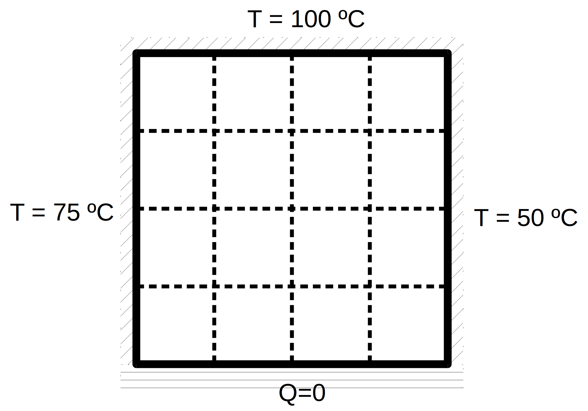

# Guía 2

1. Se tiene una placa cuadrada de aluminio cuyos bordes están en las
condiciones que se indican en la figura: tres lados a temperaturas fijas
y otro, el inferior, aislado térmicamente (flujo de calor igual a cero).
Encuentre, utilizando el método de diferencias finitas, los valores de
temperatura y flujo de calor para cada punto. Utilice primero la grilla
señalada y luego generalice el problema a un número variable de nodos en
cada eje de coordenadas. Haga un estudio del tiempo de cálculo en
función del tamaño del sistema.

 

1. Se tiene una barra delgada de aluminio, originalmente a 0o C,
cuyos extremos se someten repentinamente a temperaturas fijas.
El extremo izquierdo se mantiene a una temperatura constante de 100o C y el
derecho a 50o C. Utilice los métodos explícito e implícito
(Crank-Nicolson) de diferencias finitas para calcular la evolución de la
distribución de temperaturas en función del tiempo. Tome que la barra
tiene 10 cm de longitud y k = 0.835 cm$^2$/s (aluminio). Haga los cálculos
para $\Delta$ x = 2 cm y $\Delta$ t = 0.1 seg.
Repítalos para $\Delta$ t = 5 seg y compare sus resultados.
Analice el comportamiento de la solución para los distintos regímenes.
